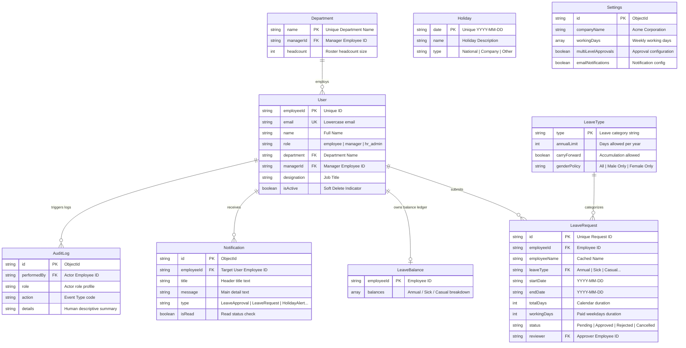

# 🗄️ Employee Leave Management System (ELMS) — Database Schema

This document outlines the MongoDB schema, collection structures, relational references, indexing policies, and validation rules for the **Employee Leave Management System (ELMS)**. All document models are modeled using the Mongoose ODM library.

---

## 📌 Table of Contents
1. [Database Overview](#1-database-overview)
2. [Collection Relationships Diagram (Mermaid)](#2-collection-relationships-diagram-mermaid)
3. [MongoDB Collections Specifications](#3-mongodb-collections-specifications)
   * [Users](#users)
   * [LeaveRequests](#leaverequests)
   * [LeaveBalances](#leavebalances)
   * [Departments](#departments)
   * [LeaveTypes](#leavetypes)
   * [Holidays](#holidays)
   * [Notifications](#notifications)
   * [AuditLogs](#auditlogs)
   * [Settings](#settings)
4. [Collection Interactions Workflow](#4-collection-interactions-workflow)

---

## 1. Database Overview
ELMS uses a document-oriented database design in MongoDB. Unlike traditional SQL databases that enforce rigid foreign key tables, MongoDB models represent relations through logical string keys (e.g. `employeeId`, `leaveType`, `department` name).

* **Primary Mongoose Validation Features:** Strict regex checks, custom schema constraints, lowercase normalization, automatic ISO date checks, and multi-field compound indexing.

---

## 2. Collection Relationships Diagram (Mermaid)

---

## 3. MongoDB Collections Specifications

### Users
Stores profiles, organization positions, authority mapping, and messaging preferences.

* **Collection Name:** `users`
* **Fields:**
  | Field | Type | Rules / Validation | Purpose |
  | :--- | :--- | :--- | :--- |
  | `employeeId` | String | Unique, Index, Required, Trimmed | Unique employee number identifier (e.g. `EMP-10024`). |
  | `name` | String | Required, Trimmed | Full display name. |
  | `email` | String | Unique, Required, Lowercase, Index, Trimmed | Corporate email address. |
  | `passwordHash` | String | Required | Encrypted password string. |
  | `role` | String | Required, Enum: `["employee", "manager", "hr_admin"]` | Access authorization role control. |
  | `department` | String | Required, Index, Trimmed | Assigned corporate department string. |
  | `designation` | String | Required, Trimmed | Position/Job Title. |
  | `managerId` | String | Default: `null`, Index, Trimmed | Direct manager's employee ID. |
  | `isActive` | Boolean | Default: `true` | Soft delete flag indicator. |
  | `phone` | String | Default: `""`, Trimmed | Contact phone number. |
  | `emailAlerts` | Boolean | Default: `true` | Opt-in for email. |
  | `smsAlerts` | Boolean | Default: `true` | Opt-in for SMS messages. |
  | `pushAlerts` | Boolean | Default: `true` | Opt-in for Web Push notifications. |
* **Indexes:**
  * Single: `{ employeeId: 1 }` (Unique)
  * Single: `{ email: 1 }` (Unique)
  * Compound: `{ employeeId: 1, email: 1 }`

---

### LeaveRequests
Records submitted leave applications, date durations, statuses, and multi-stage reviews.

* **Collection Name:** `leaverequests`
* **Fields:**
  | Field | Type | Rules / Validation | Purpose |
  | :--- | :--- | :--- | :--- |
  | `id` | String | Unique, Required, Index, Trimmed | Unique system leave identifier (e.g. `LV-299`). |
  | `employeeId` | String | Required, Index, Trimmed | Requester employee ID. |
  | `employeeName` | String | Required, Trimmed | Cached full name of employee. |
  | `leaveType` | String | Required, Index, Enum: `["Annual", "Sick", "Casual", "Maternity", "Paternity"]` | Category of leave. |
  | `startDate` | String | Required, Trimmed (Format: YYYY-MM-DD) | Start date of leave. |
  | `endDate` | String | Required, Trimmed (Format: YYYY-MM-DD) | End date of leave. |
  | `totalDays` | Number | Required, Min: `1` | Calendar days count. |
  | `workingDays` | Number | Required, Min: `1` | Weekdays count (excluding weekends). |
  | `reason` | String | Required, Min length: `10` | Employee's text justification. |
  | `status` | String | Required, Enum: `["Pending", "Approved", "Rejected", "Cancelled"]` | Current workflow approval stage. |
  | `reviewer` | String | Default: `null`, Trimmed | Employee ID of reviewer. |
  | `reviewedAt` | Date | Default: `null` | Date of approval/rejection decision. |
  | `remarks` | String | Default: `null` | Remarks/Reason comments from reviewer. |
  | `attachment` | String | Default: `null` | File path for medical/supporting upload. |
  | `currentStage` | Number | Default: `1` | Approval workflow step level. |
  | `totalStages` | Number | Default: `1` | Total workflow steps expected. |
  | `approvedBy` | Array | Strings (employee IDs) | List of managers who approved. |
  | `rejectedBy` | String | Default: `null`, Trimmed | Manager who rejected. |
* **Indexes:**
  * Single: `{ id: 1 }` (Unique)
  * Single: `{ startDate: -1 }`
  * Compound: `{ employeeId: 1, status: 1 }`

---

### LeaveBalances
Tracks individual employee balances for each leave category type.

* **Collection Name:** `leavebalances`
* **Fields:**
  | Field | Type | Rules / Validation | Purpose |
  | :--- | :--- | :--- | :--- |
  | `employeeId` | String | Unique, Required, Index, Trimmed | Owner employee ID. |
  | `balances` | Array | Array of Subdocuments | Breakdown of leave allocations. |
  * **Balances Subdocument Fields:**
    * `type` (String, Required, Trimmed): Leave type category.
    * `total` (Number, Required, Min: 0): Allowed days limit.
    * `used` (Number, Required, Default: 0, Min: 0): Deducted/taken days limit.
    * `available` (Number, Required, Min: 0): Remaining days balance.
* **Indexes:**
  * Single: `{ employeeId: 1 }` (Unique)

---

### Departments
Maintains organizational department structures and headcount statistics.

* **Collection Name:** `departments`
* **Fields:**
  | Field | Type | Rules / Validation | Purpose |
  | :--- | :--- | :--- | :--- |
  | `name` | String | Unique, Required, Index, Trimmed | Unique department division name. |
  | `managerId` | String | Default: `null`, Index, Trimmed | Assigned division head manager ID. |
  | `headcount` | Number | Required, Default: 0, Min: 0 | Number of active profiles linked. |
* **Indexes:**
  * Single: `{ name: 1 }` (Unique)

---

### LeaveTypes
Defines corporate policies, annual limits, and rules for leave types.

* **Collection Name:** `leavetypes`
* **Fields:**
  | Field | Type | Rules / Validation | Purpose |
  | :--- | :--- | :--- | :--- |
  | `type` | String | Unique, Required, Index, Trimmed | Leave category type name. |
  | `annualLimit` | Number | Required, Min: 0 | Days limit allowed per year. |
  | `carryForward` | Boolean | Required, Default: `false` | Accumulation flag status. |
  | `genderPolicy` | String | Required, Enum: `["All", "Male Only", "Female Only"]` | Gender policy filter checks. |
* **Indexes:**
  * Single: `{ type: 1 }` (Unique)

---

### Holidays
Maintains corporate and national public holidays.

* **Collection Name:** `holidays`
* **Fields:**
  | Field | Type | Rules / Validation | Purpose |
  | :--- | :--- | :--- | :--- |
  | `name` | String | Required, Trimmed | Holiday description title. |
  | `date` | String | Unique, Required, Index, Trimmed (Format: YYYY-MM-DD) | Scheduled date. |
  | `type` | String | Required, Enum: `["National", "Company", "Other"]` | Classification. |
* **Indexes:**
  * Single: `{ date: 1 }` (Unique)

---

### Notifications
Stores system alerts for users (unread/read state).

* **Collection Name:** `notifications`
* **Fields:**
  | Field | Type | Rules / Validation | Purpose |
  | :--- | :--- | :--- | :--- |
  | `employeeId` | String | Required, Index, Trimmed | Recipient user ID. |
  | `title` | String | Required, Trimmed | Header display title. |
  | `message` | String | Required | Notification detail description. |
  | `isRead` | Boolean | Required, Default: `false`, Index | Read toggle state flag. |
  | `type` | String | Required, Enum: `["LeaveApproval", "LeaveRequest", "PolicyChange", "SystemAlert", "HolidayAlert"]` | Icon & click-routing class. |
* **Indexes:**
  * Single: `{ employeeId: 1 }`
  * Single: `{ isRead: 1 }`

---

### AuditLogs
Records system operations for security audits.

* **Collection Name:** `auditlogs`
* **Fields:**
  | Field | Type | Rules / Validation | Purpose |
  | :--- | :--- | :--- | :--- |
  | `performedBy` | String | Required, Index, Trimmed | Actor Employee ID. |
  | `role` | String | Required, Enum: `["employee", "manager", "hr_admin"]` | Role performing action. |
  | `action` | String | Required, Index | Operation code (e.g. `LEAVE_APPROVED`). |
  | `details` | String | Required | Descriptive summary text. |
  | `ipAddress` | String | Default: `null` | IP Address of client browser. |
  | `userAgent` | String | Default: `null` | User-Agent string. |
* **Indexes:**
  * Single: `{ performedBy: 1 }`
  * Single: `{ action: 1 }`
  * Single: `{ createdAt: -1 }`

---

### Settings
Stores global system configurations.

* **Collection Name:** `settings`
* **Fields:**
  | Field | Type | Rules / Validation | Purpose |
  | :--- | :--- | :--- | :--- |
  | `companyName` | String | Required, Default: "Acme Corporation Ltd", Trimmed | Custom company name. |
  | `workingDays` | Array | Array of Strings (Enum: Monday-Sunday) | Scheduled working weekdays. |
  | `multiLevelApprovals` | Boolean | Required, Default: `true` | Multi-manager review approvals check. |
  | `emailNotifications` | Boolean | Required, Default: `true` | Global email alerts toggle. |

---

## 4. Collection Interactions Workflow

The database models are designed to ensure data integrity during leave workflows:

### A. Employee Registration
1. HR Admin submits details (`users` collection).
2. The user profile is created, and the system queries active policy guidelines in `leavetypes`.
3. A ledger entry is created in `leavebalances` for the new `employeeId`, seeded with the default balances defined in `leavetypes`.
4. The corresponding `Department` document's `headcount` value is incremented.

### B. Submitting a Leave Request
1. Employee fills date fields.
2. The server queries `holidays` and counts working days.
3. The server checks `leavebalances` to verify the user has sufficient available days.
4. The request is created in `leaverequests` as `"Pending"`.
5. A notification document is created in `notifications` for the manager (`managerId`).

### C. Reviewing (Approving) a Leave Request
1. Manager approves the request.
2. The request status in `leaverequests` updates to `"Approved"`.
3. The user's ledger in `leavebalances` is updated, decrementing the `available` count and incrementing the `used` count.
4. An `AuditLog` entry is created to log the action.
5. A notification is sent to the employee.
