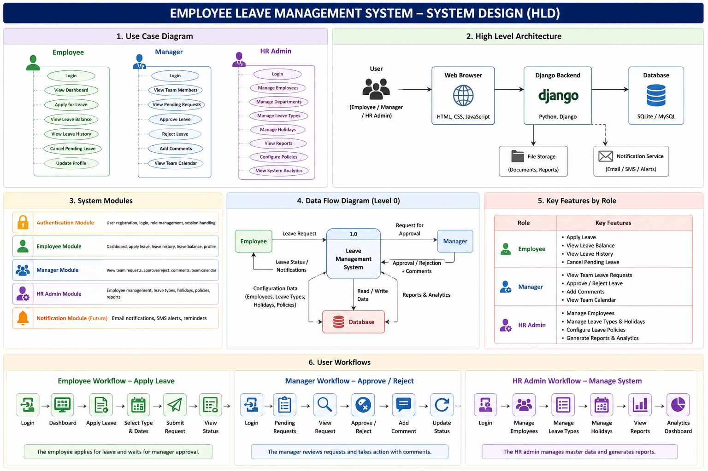

# High-Level Design (HLD)

## System Architecture

```text
Browser (HTML + CSS + JavaScript)
                ↓
         Django Backend
                ↓
        Business Logic Layer
                ↓
        SQLite / MySQL Database
```

---

## Major Modules

### Authentication Module

Responsibilities:

* User login
* Session management
* Role-based access

---

### Employee Module

Responsibilities:

* Leave applications
* Leave history
* Leave balances
* Profile management

---

### Manager Module

Responsibilities:

* Approve or reject requests
* Team leave calendar
* Comments on requests

---

### HR Admin Module

Responsibilities:

* Employee management
* Leave type configuration
* Holiday management
* Policy management
* Reports

---

### Notification Module (Future)

Responsibilities:

* Email notifications
* SMS notifications
* Reminder alerts

---

## Data Flow

Employee
↓
Frontend
↓
Django Backend
↓
Database

Manager
↓
Approve/Reject
↓
Backend
↓
Update Leave Status
↓
Employee Notification

```
```
## System Design Diagram

