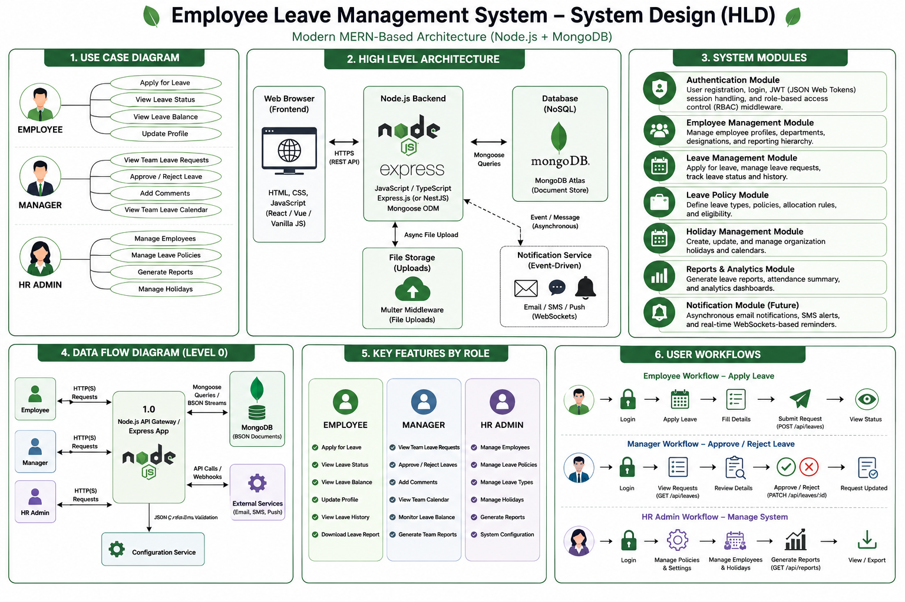

# High-Level Design (HLD)

## System Architecture

```text
       Web Browser (React Frontend)
                    ↓  HTTPS (REST API)
          Node.js + Express Backend
                    ↓  Mongoose ODM Queries
           MongoDB Atlas (NoSQL)
```

---

## Major Modules

### Authentication Module

Responsibilities:
* User registration & login
* JWT (JSON Web Tokens) session handling
* Role-based access control (RBAC) middleware

---

### Employee Module

Responsibilities:
* Leave applications (`POST /api/leaves`)
* Leave history lookup
* Leave balances dashboard preview
* Profile update & mock file uploads (Multer middleware)
* Leave report downloads

---

### Manager Module

Responsibilities:
* View team leave requests (`GET /api/leaves`)
* Approve / reject requests (`PATCH /api/leaves/:id`)
* Add manager review remarks / comments
* View team leave calendar
* Monitor leave balance allocation
* Generate team reports

---

### HR Admin Module

Responsibilities:
* Employee directory CRUD management
* Leave types policy configuration
* Holiday calendar management
* System reports generation
* General system settings configuration

---

### Notification Module (Future)

Responsibilities:
* Asynchronous email notifications
* SMS alerts
* Real-time WebSockets-based reminders

---

## Data Flow

Employee
↓
React Frontend
↓
Node.js + Express Gateway
↓
MongoDB Atlas Documents Store

Manager
↓
Review Action
↓
Express REST API Routing
↓
Update Request Status (Mongoose Query)
↓
Asynchronous Notification Dispatched

```
```

## System Design Diagram

