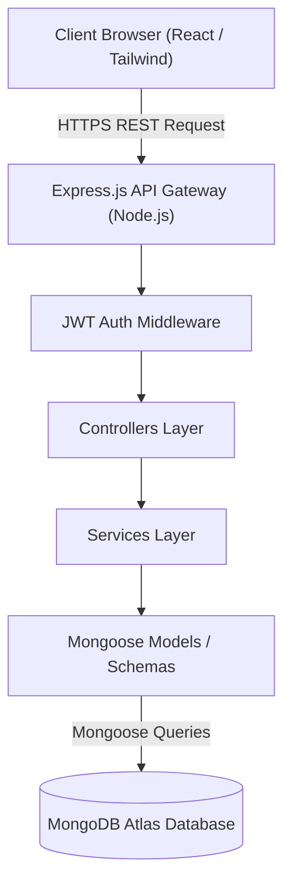
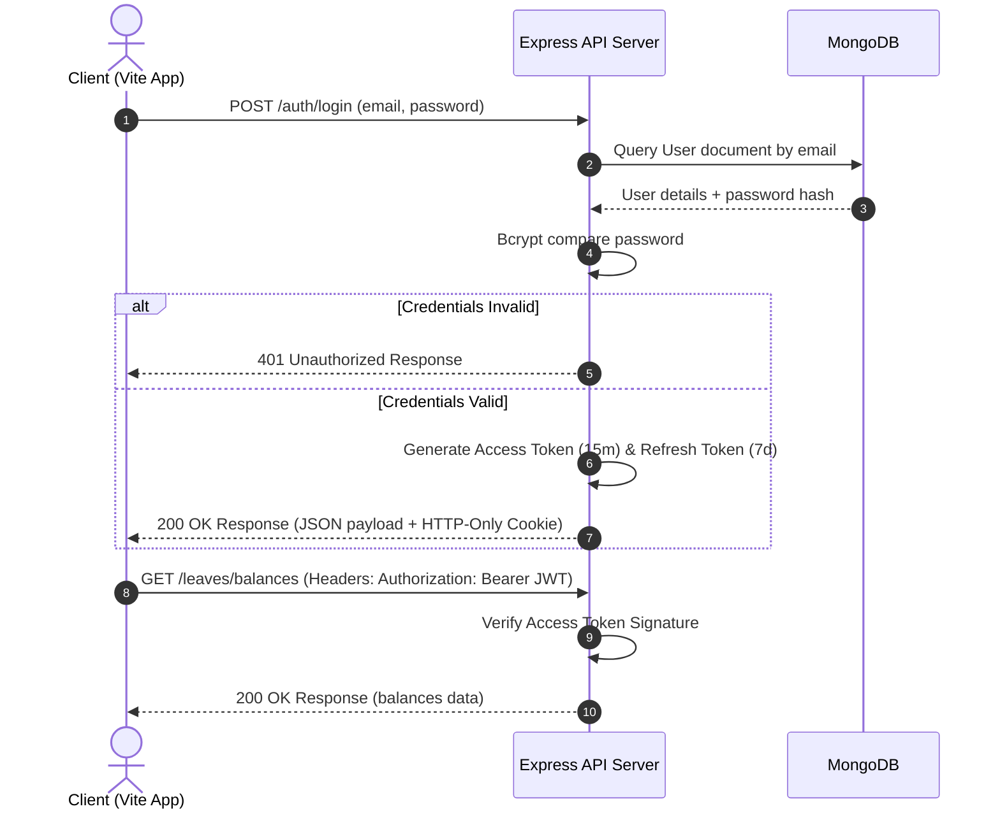
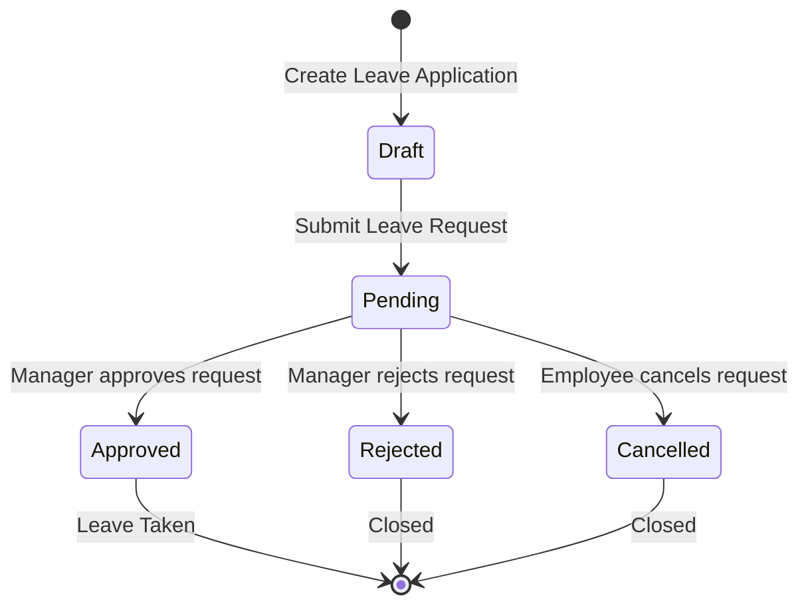
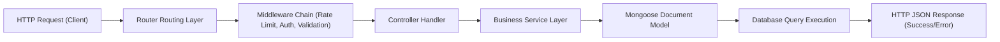

# 🏗️ Employee Leave Management System (ELMS) — System Architecture

This document describes the design principles, structural patterns, deployment layouts, and engineering workflows of the **Employee Leave Management System (ELMS)**. It combines the frontend client guidelines with backend API designs.

---

## 📌 Table of Contents
1. [Executive Summary](#1-executive-summary)
2. [Technology Stack](#2-technology-stack)
3. [System Architecture Diagram](#3-system-architecture-diagram)
4. [Folder Structure](#4-folder-structure)
5. [Routing Security & Flow](#5-routing-security--flow)
6. [Frontend Architecture](#6-frontend-architecture)
7. [Backend Architecture](#7-backend-architecture)
8. [Database Architecture](#8-database-architecture)
9. [Authentication Flow (Mermaid)](#9-authentication-flow-mermaid)
10. [Leave Approval Workflow (Mermaid)](#10-leave-approval-workflow-mermaid)
11. [Request Lifecycle (Mermaid)](#11-request-lifecycle-mermaid)
12. [Design Patterns & Naming Conventions](#12-design-patterns--naming-conventions)
13. [Security, Logging, & Error Handling](#13-security-logging--error-handling)
14. [Deployment Architecture Diagram (Mermaid)](#14-deployment-architecture-diagram-mermaid)
15. [Scalability & Future Enhancements](#15-scalability--future-enhancements)

---

## 1. Executive Summary
ELMS is a multi-tenant corporate productivity platform that handles employee identity profiles, custom leave categories, date limits, and multi-stage manager approval queues. The platform is designed using a decoupled client-server pattern. The client is a single-page application (SPA), and the backend is a stateless RESTful API engine with a document-oriented database.

---

## 2. Technology Stack

### 💻 Stack Overview

| Layer | Technology | Purpose |
| :--- | :--- | :--- |
| **Client Core** | React 18 / Vite 8 | UI rendering engine and high-performance frontend build tool. |
| **Routing Security** | React Router v7 / DOM | Declarative client routing and route guards. |
| **Design System** | Tailwind CSS v4 | Global variable-based utility styling layer. |
| **Primitives Engine** | Radix UI / Base UI | Unstyled, fully accessible interactive markup. |
| **API Client** | Axios | Standardized HTTP requests with token auto-injection. |
| **Backend Core** | Node.js / Express.js | High-performance, asynchronous REST API gateway. |
| **Object Modeling** | Mongoose ODM | Validation schemas and MongoDB query mapping. |
| **Database** | MongoDB Atlas | Cloud NoSQL document store. |
| **Authentication** | JWT / Bcrypt | Stateless access tokens and secure password hashing. |

### 🎨 Theme & Styling System
Styling uses **Tailwind CSS v4** with HSL theme color variables:
* **Backgrounds & Cards:** Configured with clean light-gray variables to match dashboard modes.
* **Primary Branding:** Node.js primary green theme.
* **Secondary Branding:** MongoDB green accents.
* **Status Colors:** Standardized classes (e.g. Approved = emerald, Rejected = rose) defined in constants to maintain visual consistency.

---

## 3. System Architecture Diagram



---

## 4. Folder Structure

The ELMS workspace structures backend and frontend files into separate directories:

```text
employee-leave-management-system/
├── backend/
│   ├── src/
│   │   ├── config/          # Database pools, rate-limiters, logs configs
│   │   ├── controllers/     # Payload parsing & REST responses mappings
│   │   ├── middleware/      # Authentication, role access, global errors
│   │   ├── models/          # Mongoose Schemas (User, LeaveRequest, etc.)
│   │   ├── routes/          # API route bindings & endpoints path maps
│   │   ├── services/        # Core business operations logic
│   │   └── validators/      # Schema definitions check validators
│   ├── tests/               # Backend endpoint test cases
│   └── server.js            # Express server entry point
└── frontend/
    ├── src/
    │   ├── components/      # Presenter components (Layout, UI)
    │   │   ├── dashboard/   # Cards for Employee / Manager views
    │   │   ├── layout/      # Sidebar navigation and header bar
    │   │   └── ui/          # Custom styled base elements
    │   ├── constants/       # Static routes, roles configurations
    │   ├── context/         # AuthContext session providers
    │   ├── data/            # JSON collections simulating DB entries
    │   ├── layouts/         # Structural layout grids (Admin, Manager)
    │   ├── lib/             # Axios API client setup (apiClient)
    │   ├── middleware/      # ProtectedRoute check wrappers
    │   ├── pages/           # Pages (Dashboard, Applying, Directory)
    │   └── services/        # API service requests layer
```

---

## 5. Routing Security & Flow

Client routing is configured with nested layouts and route guards in React Router:

```text
                  ┌──────────────────────┐
                  │   BrowserRouter      │
                  └──────────┬───────────┘
                             │
              ┌──────────────┴──────────────┐
              ▼                             ▼
     ┌─────────────────┐           ┌─────────────────┐
     │  Public Layout  │           │ Protected Route │
     └────────┬────────┘           └────────┬────────┘
              │                             │
        ┌──────┴──────┐               ┌──────┴──────┐
        ▼             ▼               ▼             ▼
     [/login]       [/]       [RoleProtectedRoute]
                                     │
                    ┌────────────────┼────────────────┐
                    ▼                ▼                ▼
                 [Employee]       [Manager]        [HR Admin]
                    │                │                │
            [/employee/*]       [/manager/*]      [/admin/*]
```

* **ProtectedRoute:** Redirects unauthorized users to `/login` if the JWT token is missing or expired.
* **RoleProtectedRoute:** Checks the user's role against permissions, redirecting unauthorized roles to `/unauthorized`.

---

## 6. Frontend Architecture

The React application uses a unidirectional data-flow model:
1. **User Action:** Presentational components trigger events.
2. **State Updates:** State-aware page containers process events.
3. **Data Request:** Pages fetch data from the service layer.
4. **UI Update:** Pages pass updated data back to components as props.

### Layout Definitions
* **Public Layout:** Contains public pages (e.g. login form).
* **Employee / Manager / Admin Layouts:** Includes the sidebar, header topbar, and main content area.

### State Management
* **Global Session State:** Managed by `AuthContext.jsx`, providing session context parameters (`user`, `isAuthenticated`, `loading`).
* **Page-Specific Domain State:** Managed by orchestrator page containers (e.g., `ApplyLeave.jsx`, `LeaveHistory.jsx`).

---

## 7. Backend Architecture

The backend uses a layered architecture to process requests:
* **Stateless Gateway:** Ensures scalability since servers do not store session state.
* **Router Mapping:** Decouples paths declarations from controllers.
* **Middleware Pipelines:** Executes security rules, rate limiters, payload validators, and CORS parameters before handing off to controllers.

---

## 8. Database Architecture
MongoDB Atlas is used for storage. The database uses relational linking:
* **Keys Integration:** Linked collections use standard keys (such as `employeeId` or `leaveType` name) instead of hard DB joins.
* **Indexing Strategy:** Compound indexes (`{ employeeId: 1, status: 1 }`) optimize queries for dashboard views and history rosters.

---

## 9. Authentication Flow (Mermaid)



---

## 10. Leave Approval Workflow (Mermaid)



---

## 11. Request Lifecycle (Mermaid)



---

## 12. Design Patterns & Naming Conventions

### Service Layer Abstraction
UI files never import Axios client configurations directly. They communicate exclusively through service objects:
```javascript
// src/services/mock/leaveService.js
export const leaveService = {
  getBalances: async (userId) => {
    const response = await apiClient.get(`/leaves/balances`);
    return response.data.data;
  }
};
```
This pattern allows switching from mock data to real API endpoints without modifying presentational components.

### Naming Conventions
To keep the codebase maintainable, we enforce strict naming rules:
* **Presentational Components:** TitleCase starting with a noun (e.g., `StatCard.jsx`).
* **Service Modules:** camelCase ending with "Service" (e.g., `leaveService.js`).
* **Utilities/Helpers:** camelCase ending with "Utils" (e.g., `historyUtils.js`).
* **Constants:** UPPER_SNAKE_CASE (e.g., `LEAVE_STATUS`).
* **Directories:** kebab-case (e.g., `leave-application/`).

---

## 13. Security, Logging, & Error Handling

### Security Configuration
* **Helmet:** Restricts XSS attacks, clickjacking, and mime-type sniffing.
* **CORS:** Configured to whitelist only the production client domain.
* **Rate Limiting:** Protects API endpoints against brute-force attacks.

### Winston Logger Config
* Collects detailed logs, grouping them into `error.log` and `combined.log`. Logs are streamed to standard output during local development.

### Centralized Error Handler
* Unhandled exceptions or validation errors are caught by a global middleware, returning consistent error formats and hiding stack traces in production.

---

## 14. Deployment Architecture Diagram (Mermaid)

```mermaid
graph TB
    Vercel["Vercel SPA Hosting (React Client)"]
    Render["Render Cloud Platform (Express Backend Container)"]
    Atlas["MongoDB Atlas Cloud (Data Layer)"]
    Users["Staff Web Clients (Desktop/Mobile)"]

    Users -->|HTTPS / SPA Navigation| Vercel
    Vercel -->|REST API Calls (CORS)| Render
    Render -->|MongoDB Protocol (TLS)| Atlas
```

---

## 15. Scalability & Future Enhancements
* **Redis Caching Layer:** Cache static data (such as holiday calendars, departments, and policy limits) in a Redis caching layer to reduce database reads and improve performance.
* **Shared Storage Buckets:** Move leave request attachments from local directories to secure cloud storage (e.g., AWS S3) to support horizontal scaling.
* **Background Task Workers:** Offload heavy tasks (such as generating PDF reports or mailing list broadcasts) to background task queues using BullMQ.
