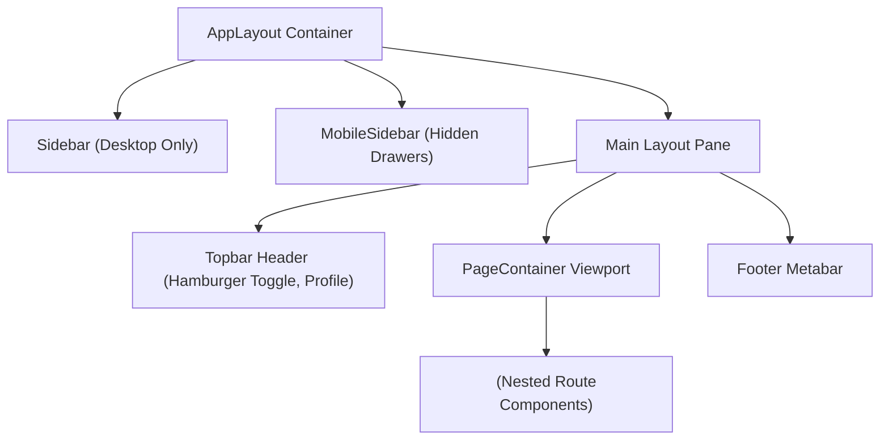

# Frontend Architecture Documentation

This document outlines the technical architecture, design system, directory structure, and routing paradigms implemented in the React + Vite frontend of the **Employee Leave Management System (LeavePortal)**.

---

## 🏗️ Technical Stack

* **Core Framework**: React 19 + Vite 8
* **Styling**: Tailwind CSS v4 + `shadcn/ui` components (Nova preset)
* **Icons**: `lucide-react`
* **Typography**: Geist Variable (Geist Sans)
* **Routing**: React Router v7 (`react-router-dom`)
* **State Management**: React Context (Current) / TanStack Query (Future)

---

## 📁 Directory Structure

The `frontend/src` directory is organized using modular directory boundaries:

```text
src/
├── 📁 assets/                 # Brand assets, fonts, icons, and static images
├── 📁 components/             # Reusable UI widgets
│   ├── 📁 common/             # Simple atomic items (loaders, spinners)
│   ├── 📁 forms/              # Controlled input structures
│   ├── 📁 layout/             # Unified shell items (Sidebar, Topbar, Logo)
│   └── 📁 ui/                 # shadcn base widgets (button, card, avatar)
├── 📁 config/                 # Global navigation profiles and system themes
├── 📁 constants/              # System constants (ROLES, ROUTES)
├── 📁 context/                # Authentication and session contexts (Future)
├── 📁 data/                   # Offline datasets and local mock metrics
├── 📁 hooks/                  # Custom state hooks
├── 📁 layouts/                # Unified wrapper layouts (AppLayout, PublicLayout)
├── 📁 lib/                    # Utility library adapters (utils, tailwind merges)
├── 📁 middleware/             # Route authentication guards and interceptors
├── 📁 pages/                  # Route level page views (Employee, Manager, Admin dashboards)
├── 📁 routes/                 # Routing engine router configurations
├── 📁 services/               # API clients, axios setups, backend connections
├── 📁 styles/                 # Theme extensions and overrides
└── 📁 types/                  # Type profiles and schema validations
```

---

## 🔑 System Role Constants

Role tokens are centralized inside [`src/constants/roles.js`](file:///c:/Users/Lenovo/OneDrive/Documents/Projects/employee-leave-management-system/frontend/src/constants/roles.js):

| Constant | String Key | Style Highlight | Target Viewport |
| :--- | :--- | :--- | :--- |
| `ROLES.EMPLOYEE` | `"employee"` | Emerald Green | Employee Dashboard |
| `ROLES.MANAGER` | `"manager"` | Indigo Blue | Team Approvals Management |
| `ROLES.HR_ADMIN` | `"hr_admin"` | Teal Green | HR Administration |

---

## 🌐 Dynamic Navigation Profiles

Unified configurations are specified in [`src/config/navigation.js`](file:///c:/Users/Lenovo/OneDrive/Documents/Projects/employee-leave-management-system/frontend/src/config/navigation.js) where each node contains:
* `label`: Sidebar presentation text
* `route`: Target navigation path
* `icon`: Lucide icon reference
* `role`: Required authentication role constant

### Navigation Nodes Mapped:
1. **Employee Flow**:
   * Dashboard (`/employee/dashboard`)
   * Apply Leave (`/employee/apply-leave`)
   * Leave History (`/employee/history`)
   * Leave Balance (`/employee/balance`)
   * Profile (`/employee/profile`)
2. **Manager Flow**:
   * Dashboard (`/manager/dashboard`)
   * Pending Requests (`/manager/requests`)
   * Team Calendar (`/manager/calendar`)
   * Team Members (`/manager/members`)
3. **HR Admin Flow**:
   * Dashboard (`/admin/dashboard`)
   * Employees (`/admin/employees`)
   * Leave Types (`/admin/leave-types`)
   * Holidays (`/admin/holidays`)
   * Reports (`/admin/reports`)
   * Settings (`/admin/settings`)

---

## 🎨 Theme Configuration

We maintain absolute UI token synchronization inside [`src/config/theme.js`](file:///c:/Users/Lenovo/OneDrive/Documents/Projects/employee-leave-management-system/frontend/src/config/theme.js):

* **Primary Colors**: Node.js Green (`#118D4F` / `#68A063`) & MongoDB Deep Slate (`#001E2B`)
* **Standard Alerts**: Success (`#22C55E`), Warning (`#F59E0B`), Danger (`#EF4444`), Info (`#3B82F6`)
* **Radii Constraints**: `sm: 6px`, `md: 10px`, `lg: 14px`, `xl: 18px`
* **Layout Constraints**: Sidebar Width (`280px`), Topbar Height (`72px`)

---

## 🗺️ Unified Layout Wrapper Pattern

Nested route renders are structured under the unified [`src/layouts/AppLayout.jsx`](file:///c:/Users/Lenovo/OneDrive/Documents/Projects/employee-leave-management-system/frontend/src/layouts/AppLayout.jsx):


